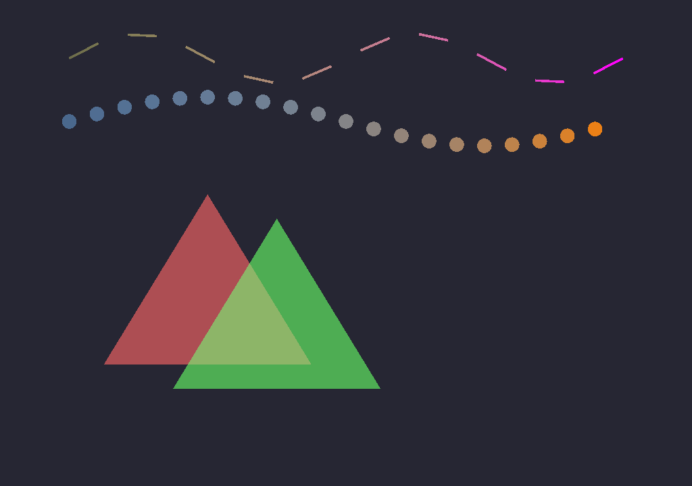
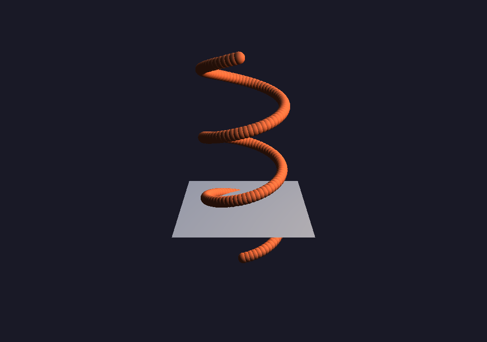
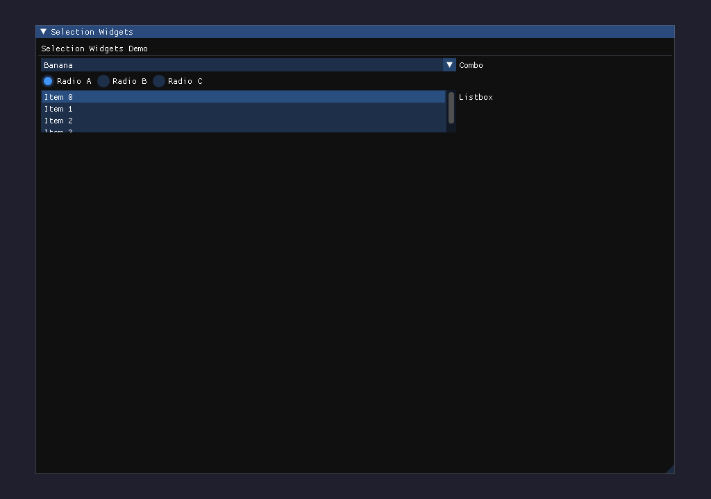
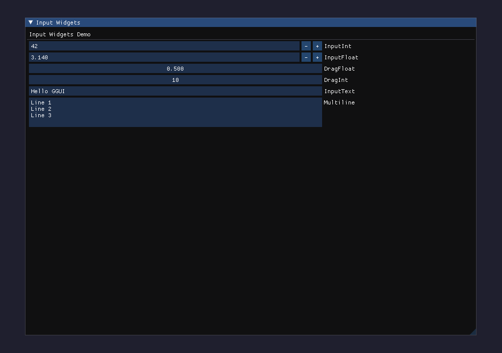
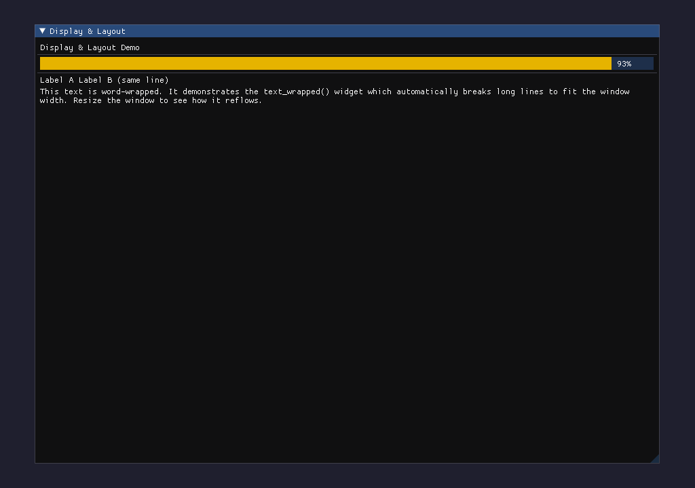
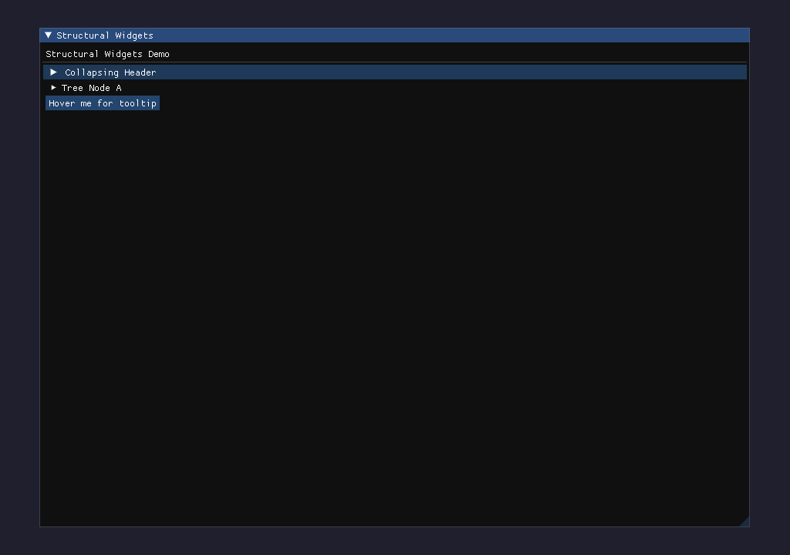
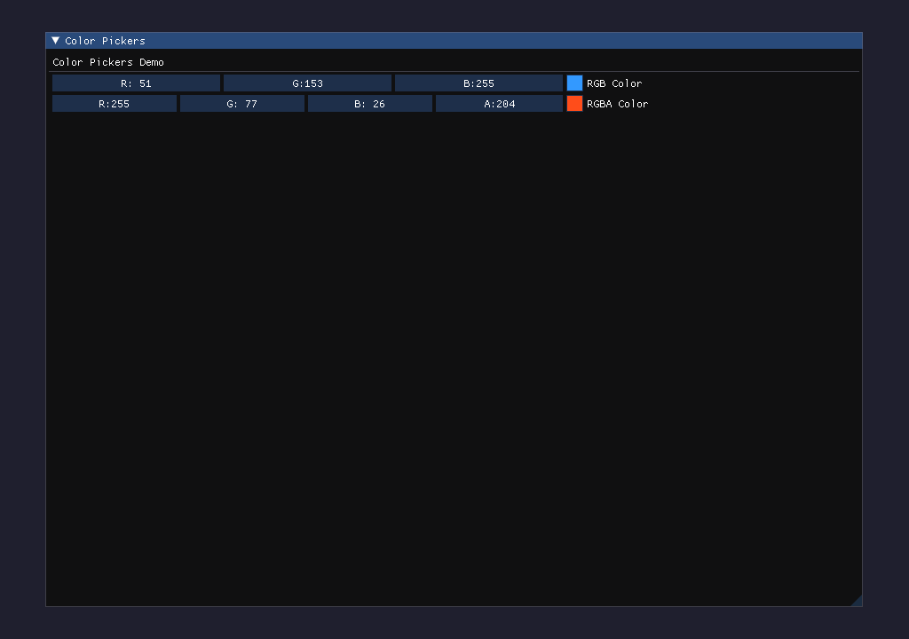
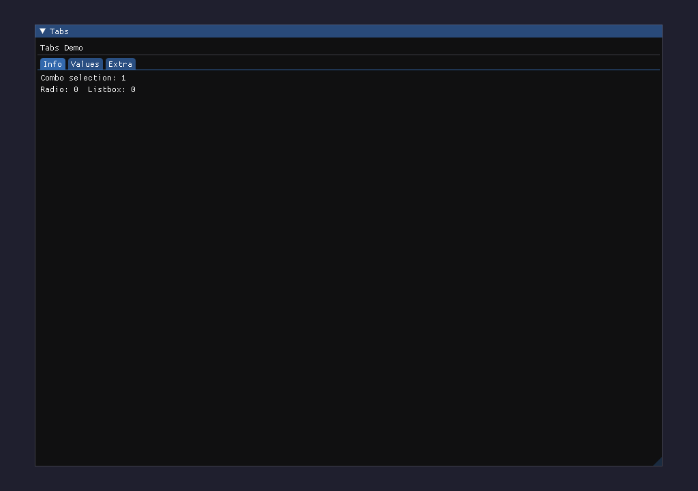
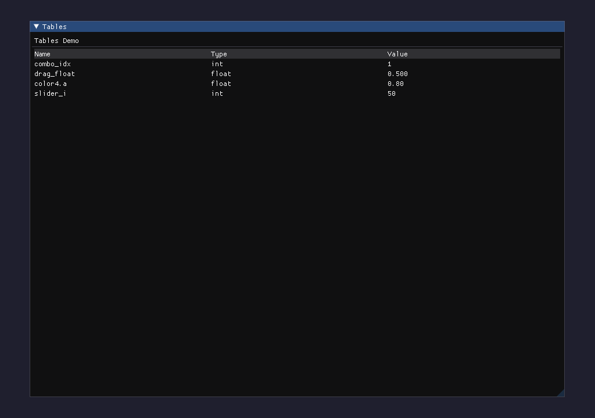
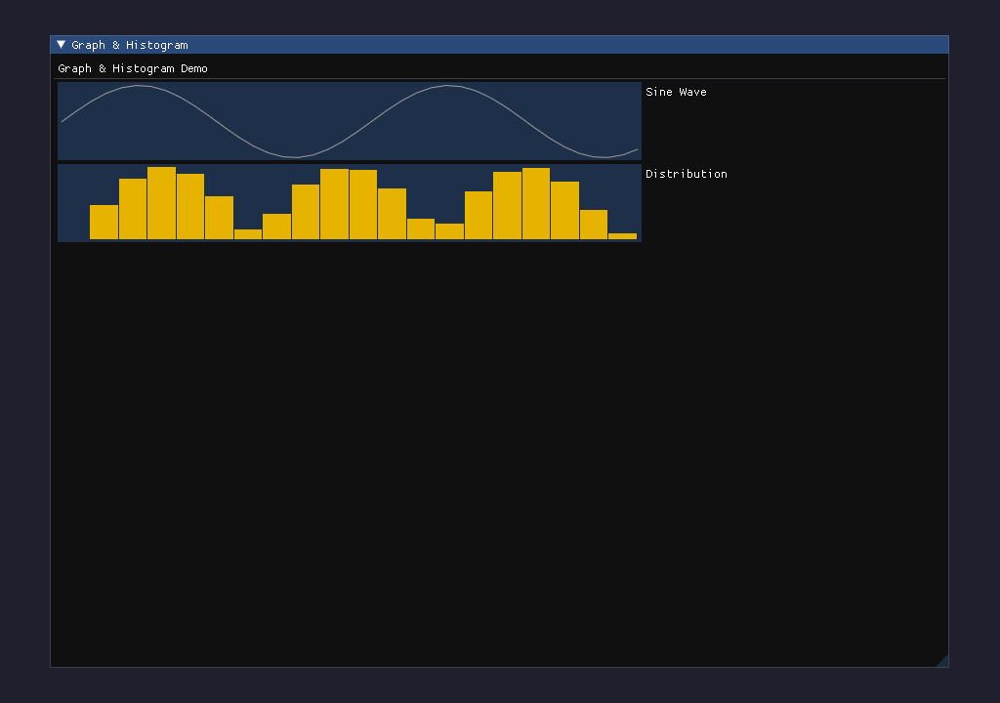

# A New UI system: GGUI

| **Category** | **Prerequisites**          |
| ------------ | -------------------------- |
| OS           | Windows / Linux / Mac OS X |
| Backend      | x64 / CUDA / Vulkan        |

Starting from v0.8.0, Taichi adds a new UI system GGUI. The new system uses GPU for rendering, making it much faster to render 3D scenes. That is why this new system gets its name as GGUI. This document describes the APIs that it provides.

:::caution IMPORTANT
If you choose Vulkan as backend, ensure that you [install the Vulkan environment](https://vulkan.lunarg.com/sdk/home).
:::

:::note
It is recommended that you familiarize yourself with GGUI through the examples in `examples/ggui_examples`.
:::

:::note
The variables referenced in code snippets below are define like this:

```python as-prelude:vars
vertices         = ti.Vector.field(2, ti.f32, shape=200)
vertices_3d      = ti.Vector.field(3, ti.f32, shape=200)
indices          = ti.field(ti.i32, shape=200 * 3)
normals          = ti.Vector.field(3, ti.f32, shape=200)
per_vertex_color = ti.Vector.field(3, ti.f32, shape=200)

color  = (0.5, 0.5, 0.5)
```
:::

## Create a window

`ti.ui.Window(name, res)` creates a window.

```python preludes:vars
window = ti.ui.Window(name='Window Title', res = (640, 360), fps_limit=200, pos = (150, 150))
```

- The `name` parameter sets the title of the window.
- The `res` parameter specifies the resolution (width and height) of the window.
- The `fps_limit` parameter sets the maximum frames per second (FPS) for the window.
- The `pos` parameter specifies the position of the window with respect to the top-left corner of the main screen.

A `ti.ui.Window` can display three types of objects:

- 2D Canvas, which is used to draw simple 2D geometries like circles and triangles.+ 3D Scene, which is used to render 3D meshes and particles, and provides configurable camera and light sources.
- Immediate mode GUI components, such as buttons and textboxes.

## 2D Canvas

### Create a canvas

The following code retrieves a `Canvas` object that covers the entire window.

```python cont
canvas = window.get_canvas()
```

### Draw on the canvas

```python cont
canvas.set_background_color(color)
canvas.triangles(vertices, color, indices, per_vertex_color)

radius = 5
canvas.circles(vertices, radius, color, per_vertex_color)

width = 2
canvas.lines(vertices, width, indices, color, per_vertex_color)
canvas.set_image(window.get_image_buffer_as_numpy())
```

The arguments `vertices`, `indices`, `per_vertex_color`, and `image` must be Taichi fields. If `per_vertex_color` is provided, `color` is ignored.

The positions/centers of geometries are represented as floats between `0.0` and `1.0`, which indicate the relative positions of the geometries on the canvas. For `circles()` and `lines()`, the `radius` and `width` arguments are relative to the height of the window.

The canvas is cleared after every frame. Always call these methods within the render loop.

### RGBA per-vertex color (alpha transparency)

The `per_vertex_color` field can be either a 3-component (RGB) or 4-component (RGBA) vector field. When using 4-component colors, the alpha channel controls transparency, enabling semi-transparent overlapping primitives:

```python
# Semi-transparent triangles with per-vertex RGBA color
tri_verts = ti.Vector.field(3, ti.f32, shape=6)
tri_colors = ti.Vector.field(4, ti.f32, shape=6)  # 4 components: RGBA

# Red triangle, 50% transparent
tri_verts[0] = [0.2, 0.2, 0]; tri_verts[1] = [0.4, 0.2, 0]; tri_verts[2] = [0.3, 0.5, 0]
tri_colors[0] = [1, 0, 0, 0.5]; tri_colors[1] = [1, 0, 0, 0.5]; tri_colors[2] = [1, 0, 0, 0.5]

# Circles with alpha ramp
circle_centers = ti.Vector.field(3, ti.f32, shape=20)
circle_colors = ti.Vector.field(4, ti.f32, shape=20)  # alpha varies per vertex

canvas.triangles(tri_verts, per_vertex_color=tri_colors)
canvas.circles(circle_centers, radius=0.015, per_vertex_color=circle_colors)
```

Alpha blending is applied automatically when per-vertex colors have 4 components. This works for `triangles()`, `circles()`, and `lines()` on both 2D canvas and 3D scene primitives.



## 3D Scene

### Create a scene

```python cont
scene = window.get_scene()
```

### Configure camera

```python cont
camera = ti.ui.Camera()
camera.position(1, 2, 3)  # x, y, z
camera.lookat(4, 5, 6)
camera.up(0, 1, 0)
camera.projection_mode(ti.ui.ProjectionMode.Perspective)
scene.set_camera(camera)
```

### Configuring light sources

#### Add a point light

Call `point_light()` to add a point light to the scene.

```python cont
scene.point_light(pos=(1, 2, 3), color=(0.5, 0.5, 0.5))
```

Note that you need to call `point_light()` for every frame. Similar to the `canvas()` methods, call this method within your render loop.

#### Add a directional light

Call `directional_light()` to add a directional light to the scene. Unlike point lights, directional lights have no position — they represent infinitely distant light sources (like the sun) defined only by their direction and color.

```python cont
scene.directional_light(direction=(-1, -1, -0.5), color=(0.3, 0.5, 0.9))
```

The `direction` vector specifies the direction the light is shining (it will be normalized automatically). You can combine multiple point lights and directional lights in the same scene:

```python cont
scene.ambient_light((0.15, 0.15, 0.15))
scene.point_light(pos=(2, 2, 1), color=(0.8, 0.6, 0.3))
scene.directional_light(direction=(-1, -1, -0.5), color=(0.3, 0.5, 0.9))
scene.directional_light(direction=(0, -0.5, 1), color=(0.4, 0.4, 0.4))
```

Like `point_light()`, call `directional_light()` every frame within your render loop.



### 3D Geometries

```python cont
scene.lines(vertices, width, indices, color, per_vertex_color)
scene.mesh(vertices_3d, indices, normals, color, per_vertex_color)
scene.particles(vertices_3d, radius, color, per_vertex_color)
```

The arguments `vertices`, `indices`, `per_vertex_color`, and `image` are all expected to be Taichi fields. If `per_vertex_color` is provided, `color` is ignored.

The positions/centers of geometries should be in the world-space coordinates.

:::note

If a mesh has `num` triangles, the `indices` should be a 1D scalar field with a shape `(num * 3)`, _not_ a vector field.

`normals` is an optional parameter for `scene.mesh()`.

:::example

1. An example of drawing 3d-lines

```python
import taichi as ti

ti.init(arch=ti.cuda)

N = 10

particles_pos = ti.Vector.field(3, dtype=ti.f32, shape = N)
points_pos = ti.Vector.field(3, dtype=ti.f32, shape = N)

@ti.kernel
def init_points_pos(points : ti.template()):
    for i in range(points.shape[0]):
        points[i] = [i for j in ti.static(range(3))]

init_points_pos(particles_pos)
init_points_pos(points_pos)

window = ti.ui.Window("Test for Drawing 3d-lines", (768, 768))
canvas = window.get_canvas()
scene = window.get_scene()
camera = ti.ui.Camera()
camera.position(5, 2, 2)

while window.running:
    camera.track_user_inputs(window, movement_speed=0.03, hold_key=ti.ui.RMB)
    scene.set_camera(camera)
    scene.ambient_light((0.8, 0.8, 0.8))
    scene.point_light(pos=(0.5, 1.5, 1.5), color=(1, 1, 1))

    scene.particles(particles_pos, color = (0.68, 0.26, 0.19), radius = 0.1)
    # Draw 3d-lines in the scene
    scene.lines(points_pos, color = (0.28, 0.68, 0.99), width = 5.0)
    canvas.scene(scene)
    window.show()
```

### Advanced 3d Geometries

```python preludes:vars
window = ti.ui.Window(name='Advanced 3d Geometries', res = (720, 720))
scene = window.get_scene()
width = 2
radius = 5

scene.lines(vertices, width, indices, color, per_vertex_color, vertex_offset=0, vertex_count=10, index_offset=0, index_count=10)

scene.mesh(vertices_3d, indices, normals, color, per_vertex_color, vertex_offset=0, vertex_count=10, index_offset=0, index_count=10, show_wireframe=True)

scene.particles(vertices_3d, radius, color, per_vertex_color, index_offset=0, index_count=10)

scene.mesh_instance(vertices_3d, indices, normals, color, per_vertex_color, vertex_offset=0, vertex_count=10, index_offset=0, index_count=10, show_wireframe=True)
```

The additional arguments `vertex_offset`, `vertex_count`, `index_offset` and `index_count` control the visible part of the particles and mesh. For the `mesh()` and `mesh_instance()` methods, set whether to show wireframe mode through setting `show_wireframe`.

:::example

1. Example of drawing a part of the mesh/particles

```python cont
scene = window.get_scene()

center = ti.Vector.field(3, ti.f32, shape=10)

# For particles
# draw the 2-th to 7-th particles
scene.particles(center, radius=1, index_offset = 1, index_count = 6)

# For mesh
# 1. with indices
scene.mesh(
    vertices_3d, indices, index_offset=1, index_count=3,
    # vertex_offset is set to 0 by default, and it is not necessary
    # to assign vertex_offset a value that otherwise you must.
    vertex_offset = 1
    )

# usually used as below:
# draw the 11-th to 111-th mesh vertexes
scene.mesh(vertices_3d, indices, index_offset=10, index_count=100)

# 2. without indices (similar to the particles' example above)
scene.mesh(
    vertices_3d,
    vertex_offset=2,  # user defined first vertex index
    vertex_count=3,  # user defined vertex count
    )
```

2. An example of drawing part of lines

```python
import taichi as ti

ti.init(arch=ti.cuda)

N = 10

particles_pos = ti.Vector.field(3, dtype=ti.f32, shape = N)
points_pos = ti.Vector.field(3, dtype=ti.f32, shape = N)
points_indices = ti.Vector.field(1, dtype=ti.i32, shape = N)

@ti.kernel
def init_points_pos(points : ti.template()):
    for i in range(points.shape[0]):
        points[i] = [i for j in range(3)]
        # points[i] = [ti.sin(i * 1.0), i * 0.2, ti.cos(i * 1.0)]

@ti.kernel
def init_points_indices(points_indices : ti.template()):
    for i in range(N):
        points_indices[i][0] = i // 2 + i % 2

init_points_pos(particles_pos)
init_points_pos(points_pos)
init_points_indices(points_indices)

window = ti.ui.Window("Test for Drawing 3d-lines", (768, 768))
canvas = window.get_canvas()
scene = window.get_scene()
camera = ti.ui.Camera()
camera.position(5, 2, 2)

while window.running:
    camera.track_user_inputs(window, movement_speed=0.03, hold_key=ti.ui.RMB)
    scene.set_camera(camera)
    scene.ambient_light((0.8, 0.8, 0.8))
    scene.point_light(pos=(0.5, 1.5, 1.5), color=(1, 1, 1))

    scene.particles(particles_pos, color = (0.68, 0.26, 0.19), radius = 0.1)
    # Here you will get visible part from the 3rd point with (N - 4) points.
    scene.lines(points_pos, color = (0.28, 0.68, 0.99), width = 5.0, vertex_count = N - 4, vertex_offset = 2)
    # Using indices to indicate which vertex to use
    # scene.lines(points_pos, color = (0.28, 0.68, 0.99), width = 5.0, indices = points_indices)
    # Case 1, vertex_count will be changed to N - 2 when drawing.
    # scene.lines(points_pos, color = (0.28, 0.68, 0.99), width = 5.0, vertex_count = N - 1, vertex_offset = 0)
    # Case 2, vertex_count will be changed to N - 2 when drawing.
    # scene.lines(points_pos, color = (0.28, 0.68, 0.99), width = 5.0, vertex_count = N, vertex_offset = 2)
    canvas.scene(scene)
    window.show()
```

3. Details of mesh instancing

```python preludes:vars
window = ti.ui.Window("Display Instanced Mesh", (1024, 1024))
scene = window.get_scene()

num_instance = 100
m_transforms = ti.Matrix.field(4, 4, dtype = ti.f32, shape = num_instance)


# For example: An object is scaled by 2, rotated by rotMat, and translated by t = [1, 2, 3], then
#
# The ScaleMatrix is:
# 2, 0, 0, 0
# 0, 2, 0, 0
# 0, 0, 2, 0
# 0, 0, 0, 1
#
# The RotationMatrix is:
# https://en.wikipedia.org/wiki/Rotation_matrix#General_rotations
#
# The TranslationMatrix is:
# 1, 0, 0, 1
# 0, 1, 0, 2
# 0, 0, 1, 3
# 0, 0, 0, 1
#
# Let TransformMatrix = TranslationMatrix @ RotationMatrix @ ScaleMatrix, then the final TransformMatrix is:
#   2 * rotMat00,     rotMat01,       rotMat02, 1
#       rotMat10, 2 * rotMat11,       rotMat12, 2
#       rotMat20,     rotMat21,   2 * rotMat22, 3
#              0,            0,              0, 1
...

# Draw mesh instances (from the 1st instance)
scene.mesh_instance(vertices_3d, indices, transforms = m_transforms, instance_offset = 1)
```

4. Example of setting wireframe mode

```python preludes:vars
window = ti.ui.Window("Display Mesh", (1024, 1024), vsync=True)
canvas = window.get_canvas()
scene = window.get_scene()
camera = ti.ui.Camera()

# slider_int usage
some_int_type_value = 0
def show_options():
    global some_int_type_value

    window.GUI.begin("Display Panel", 0.05, 0.1, 0.2, 0.15)
    display_mode = window.GUI.slider_int("Value Range", some_int_type_value, 0, 5)
    window.GUI.end()

while window.running:

    ...
    # if to show wireframe
    scene.mesh_instance(vertices_3d, indices, instance_count = 100 , show_wireframe = True)

    canvas.scene(scene)
    show_options()
    window.show()
```

:::note

If `indices` is not provided, consider using like this:

```python preludes:vars skip-ci:Taichi-Bug
scene = window.get_scene()
scene.mesh(vertices_3d, normals, color, per_vertex_color, vertex_offset=0, vertex_count=50, show_wireframe=True)
```

If `indices` is provided, consider using like this:

```python cont
scene.mesh(vertices_3d, indices, normals, color, per_vertex_color, vertex_offset=0, index_offset=0, index_count=50, show_wireframe=True)
```

:::

### Rendering the scene

You can render a scene on a canvas.

```python cont
window = ti.ui.Window(name='Title', res=(640, 360))
canvas = window.get_canvas()
canvas.scene(scene)
```

### Fetching Color/Depth information

```python cont
img = window.get_image_buffer_as_numpy()
window.get_depth_buffer(scene_depth)
depth = window.get_depth_buffer_as_numpy()
```

After rendering the current scene, you can fetch the color and depth information of the current scene using `get_image_buffer_as_numpy()` and `get_depth_buffer_as_numpy()`, which copy the gpu data to a NumPy array(cpu).
`get_depth_buffer()` copies the GPU data to a Taichi field (depend on the `arch` you choose) or copies data from GPU to GPU.

:::example

1. Example of fetching color information

```python skip-ci:Trivial
window = ti.ui.Window("Test for getting image buffer from ggui", (768, 768), vsync=True)
video_manager = ti.tools.VideoManager("OutputDir")

while window.running:
    # render_scene()
    img = window.get_image_buffer_as_numpy()
    video_manager.write_frame(img)
    window.show()

video_manager.make_video(gif=True, mp4=True)
```

2. An example of fetching the depth data

```python
window_shape = (720, 1080)
window = ti.ui.Window("Test for copy depth data", window_shape)
canvas = window.get_canvas()
scene = window.get_scene()
camera = ti.ui.Camera()

# Get the shape of the window
w, h = window.get_window_shape()
# The field/ndarray stores the depth information, and must be of the ti.f32 data type and have a 2d shape.
# or, in other words, the shape must equal the window's shape
scene_depth = ti.ndarray(ti.f32, shape = (w, h))
# scene_depth = ti.field(ti.f32, shape = (w, h))

while window.running:
    # render()
    canvas.scene(scene)
    window.get_depth_buffer(scene_depth)
    window.show()
```

## GUI components

The design of GGUI's GUI components follows the [Dear ImGui](https://github.com/ocornut/imgui) APIs.

```python
window = ti.ui.Window("Test for GUI", res=(512, 512))
gui = window.get_gui()
value = 0
color = (1.0, 1.0, 1.0)
with gui.sub_window("Sub Window", x=10, y=10, width=300, height=100):
    gui.text("text")
    is_clicked = gui.button("name")
    value = gui.slider_float("name1", value, minimum=0, maximum=100)
    color = gui.color_edit_3("name2", color)
```

### Extended GUI widgets

GGUI provides a comprehensive set of ImGui widgets beyond the basic ones shown above.

#### Selection widgets

```python
gui = window.get_gui()
combo_idx = 0
radio_sel = 0
listbox_idx = 0

with gui.sub_window("Selection", 0, 0, 0.5, 1.0) as g:
    # Dropdown combo box
    combo_idx = g.combo("Combo", combo_idx, ["Apple", "Banana", "Cherry"])

    # Radio buttons (mutually exclusive)
    for i, label in enumerate(["Option A", "Option B", "Option C"]):
        if g.radio_button(label, radio_sel == i):
            radio_sel = i
        if i < 2:
            g.same_line()

    # Scrollable listbox
    listbox_idx = g.listbox("Listbox", listbox_idx, ["Item 0", "Item 1", "Item 2"], 3)
```

- `combo(name, old_value, items)` — Dropdown to pick one item from a list. Returns the selected index.
- `radio_button(name, active)` — A radio button. Returns `True` if clicked.
- `listbox(name, old_value, items, height_in_items=-1)` — A scrollable list. Returns the selected index.



#### Input widgets

```python
int_val = 42
float_val = 3.14
drag_f = 0.5
drag_i = 10
text_val = "Hello"
multiline_val = "Line 1\nLine 2"

with gui.sub_window("Inputs", 0, 0, 0.5, 1.0) as g:
    int_val = g.input_int("InputInt", int_val, step=1, step_fast=10)
    float_val = g.input_float("InputFloat", float_val, step=0.1, step_fast=1.0)
    drag_f = g.drag_float("DragFloat", drag_f, speed=0.005, v_min=0.0, v_max=1.0)
    drag_i = g.drag_int("DragInt", drag_i, speed=0.5, v_min=0, v_max=100)
    text_val = g.input_text("InputText", text_val)
    multiline_val = g.input_text_multiline("Multiline", multiline_val, width=0, height=60)
```

- `input_int(name, old_value, step=1, step_fast=100)` — Integer input with +/- buttons. Returns new value.
- `input_float(name, old_value, step=0.0, step_fast=0.0)` — Float input with +/- buttons. Returns new value.
- `drag_float(name, old_value, speed=1.0, v_min=0.0, v_max=0.0)` — Click-and-drag float. Returns new value.
- `drag_int(name, old_value, speed=1.0, v_min=0, v_max=0)` — Click-and-drag integer. Returns new value.
- `input_text(name, old_value)` — Single-line text input. Returns the string.
- `input_text_multiline(name, old_value, width=0.0, height=0.0)` — Multi-line text editor. Returns the string.



#### Display and layout widgets

```python
with gui.sub_window("Display", 0, 0, 0.5, 1.0) as g:
    g.progress_bar(0.6, overlay="60%")
    g.separator()
    g.text_wrapped("This text is word-wrapped to fit the window width.")
    g.same_line()  # Place next widget on same row
```

- `progress_bar(fraction, size_x=-1.0, size_y=0.0, overlay="")` — Horizontal progress bar.
- `separator()` — Horizontal divider line.
- `same_line(offset=0.0, spacing=-1.0)` — Place the next widget on the same row.
- `text_wrapped(text)` — Word-wrapped text block.



#### Structural widgets

```python
with gui.sub_window("Structure", 0, 0, 0.5, 1.0) as g:
    # Collapsing header
    if g.collapsing_header("Settings"):
        check_val = g.checkbox("Enable", check_val)
        slider_f = g.slider_float("Speed", slider_f, 0.0, 1.0)

    # Tree nodes (context manager auto-calls tree_pop)
    with g.tree("Node A") as opened:
        if opened:
            g.text("Leaf content")
            with g.tree("Nested") as nested:
                if nested:
                    g.text("Deep content")

    # Tooltip on previous widget
    g.button("Hover me")
    g.tooltip("Tooltip text appears on hover!")
```

- `collapsing_header(name)` — Expandable section. Returns `True` if open.
- `tree(name)` — Context manager for tree nodes. Yields `True` if expanded. Automatically calls `tree_pop()`.
- `tree_node(name)` / `tree_pop()` — Low-level tree node begin/end.
- `tooltip(text)` — Shows tooltip when hovering over the previous widget.



#### Color pickers

```python
color3 = (0.2, 0.6, 1.0)
color4 = (1.0, 0.3, 0.1, 0.8)

with gui.sub_window("Colors", 0, 0, 0.5, 1.0) as g:
    color3 = g.color_edit_3("RGB Color", color3)
    color4 = g.color_edit_4("RGBA Color", color4)
```

- `color_edit_3(name, old_value)` — RGB color picker. Returns a 3-tuple.
- `color_edit_4(name, old_value)` — RGBA color picker with alpha. Returns a 4-tuple.



#### Tabs

```python
with gui.sub_window("Tabs Demo", 0, 0, 0.5, 1.0) as g:
    with g.tab_bar("MyTabs") as visible:
        if visible:
            with g.tab("Tab 1") as selected:
                if selected:
                    g.text("Content of Tab 1")
            with g.tab("Tab 2") as selected:
                if selected:
                    g.text("Content of Tab 2")
```

- `tab_bar(name)` — Context manager for a tab bar. Yields `True` if visible.
- `tab(name)` — Context manager for a tab item inside a `tab_bar`. Yields `True` if the tab is selected.



#### Tables

```python
with gui.sub_window("Table Demo", 0, 0, 0.5, 1.0) as g:
    with g.table("MyTable", 3) as tbl:
        if tbl:
            g.table_setup_column("Name")
            g.table_setup_column("Type")
            g.table_setup_column("Value")
            g.table_headers_row()

            for name, typ, val in [("x", "float", "1.0"), ("y", "int", "42")]:
                g.table_next_row()
                g.table_next_column(); g.text(name)
                g.table_next_column(); g.text(typ)
                g.table_next_column(); g.text(val)
```

- `table(name, column, outer_size_x=0.0, outer_size_y=0.0)` — Context manager for a table. Yields `True` if visible.
- `table_setup_column(label)` — Define a column header.
- `table_headers_row()` — Render the header row.
- `table_next_row()` — Advance to the next row.
- `table_next_column()` — Advance to the next column. Returns `True` if visible.



#### Graph and histogram widgets

```python
import math

with gui.sub_window("Graphs", 0, 0, 0.5, 1.0) as g:
    # Line graph — plots a series of values as a connected line
    sin_values = [math.sin(i * 0.3) for i in range(40)]
    g.graph("Sine Wave", sin_values, scale_min=-1.0, scale_max=1.0,
            graph_size_x=0, graph_size_y=80)

    # Histogram — plots a series of values as vertical bars
    hist_values = [abs(math.sin(i * 0.5)) * 10 for i in range(20)]
    g.graph_histogram("Distribution", hist_values, scale_min=0.0, scale_max=10.0,
                      graph_size_x=0, graph_size_y=80)
```

- `graph(title, values, scale_min=None, scale_max=None, graph_size_x=0.0, graph_size_y=0.0, overlay_text="")` — Line graph widget. Plots `values` (a list of floats) as a connected line. Set `scale_min`/`scale_max` to fix the Y-axis range, or pass `None` for auto-scaling.
- `graph_histogram(title, values, scale_min=None, scale_max=None, graph_size_x=0.0, graph_size_y=0.0, overlay_text="")` — Histogram (bar chart) widget. Same parameters as `graph()` but renders vertical bars instead of a line.



## Show a window

Call `show()` to show a window.

```python cont
window.show()
```

Call this method _only_ at the end of the render loop for each frame.

## Runtime window title update

You can update the window title at runtime using `set_title()`:

```python cont
window.set_title("My App — Frame 100")
```

This is useful for displaying dynamic information such as FPS counters or simulation status in the title bar.

## User input processing

To retrieve the events that have occurred since the last method call:

```python cont
events = window.get_events()
```

Each `event` in `events` is an instance of `ti.ui.Event`. It has the following properties:

- `event.action`, which can be `ti.ui.PRESS`, `ti.ui.RELEASE`, or `ti.ui.MOTION`.
- `event.key`: the key related to this event.

To retrieve the mouse position:

- `window.get_cursor_pos()`

To check if a key is pressed:

- `window.is_pressed(key)`

The following is a user input processing example from [**mpm128**](https://github.com/taichi-dev/taichi/blob/master/python/taichi/examples/ggui_examples/mpm128_ggui.py):

```python cont
gravity = ti.Vector.field(2, ti.f32, shape=())
attractor_strength = ti.field(ti.f32, shape=())

while window.running:
    # keyboard event processing
    if window.get_event(ti.ui.PRESS):
        if window.event.key == 'r': reset()
        elif window.event.key in [ti.ui.ESCAPE]: break
    if window.event is not None: gravity[None] = [0, 0]  # if had any event
    if window.is_pressed(ti.ui.LEFT, 'a'): gravity[None][0] = -1
    if window.is_pressed(ti.ui.RIGHT, 'd'): gravity[None][0] = 1
    if window.is_pressed(ti.ui.UP, 'w'): gravity[None][1] = 1
    if window.is_pressed(ti.ui.DOWN, 's'): gravity[None][1] = -1

    # mouse event processing
    mouse = window.get_cursor_pos()
    # ...
    if window.is_pressed(ti.ui.LMB):
        attractor_strength[None] = 1
    if window.is_pressed(ti.ui.RMB):
        attractor_strength[None] = -1

    window.show()
```

### Mouse wheel scroll events

You can retrieve the mouse wheel scroll delta since the last call using `get_scroll_delta()`:

```python cont
scroll_x, scroll_y = window.get_scroll_delta()
```

Returns a tuple `(x, y)` where `y` is the vertical scroll amount (positive = scroll up) and `x` is the horizontal scroll amount. The values are accumulated between calls and reset to zero after each call.

```python cont
# Example: zoom camera based on mouse wheel
zoom = 1.0
while window.running:
    _, scroll_y = window.get_scroll_delta()
    zoom *= 1.0 + scroll_y * 0.1
    # ... use zoom ...
    window.show()
```

## Image I/O

To write the current frame in the window to an image file:

```python cont
window.save_image('frame.png')
```

Note that you _must_ call `window.save_image()` before calling `window.show()`.

## Off-screen rendering

GGUI supports saving frames to images without showing the window. This is also known as "headless" rendering. To enable this mode, set the argument `show_window` to `False` when initializing a window.

```python
window = ti.ui.Window('Window Title', (640, 360), show_window = False)
```

Then you can call `window.save_image()` as normal and remove the `window.show()` call at the end.
